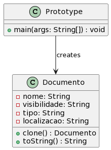
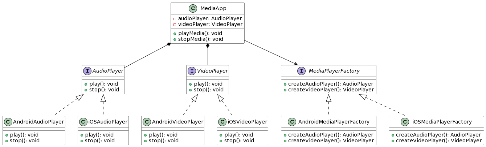
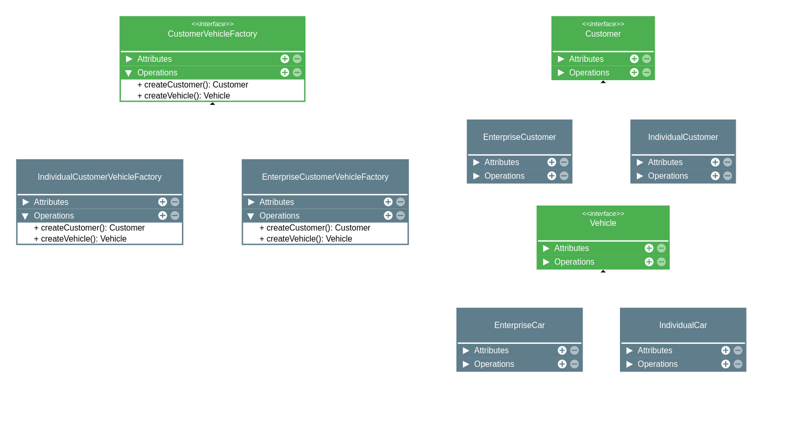

# estudo-design-pattern

## Padrão de projeto de criação

### Factory method

#### Conceito
O Factory Method é um padrão de projeto criacional que fornece uma maneira de criar objetos sem especificar sua classe concreta. Em vez de chamar diretamente o construtor de uma classe para criar um objeto, o Factory Method define um método separado, geralmente chamado de "factory method", que lida com a criação do objeto.

O objetivo principal do Factory Method é fornecer uma interface abstrata para a criação de objetos, permitindo que as subclasses decidam qual objeto criar. Dessa forma, o código cliente que usa o Factory Method não precisa conhecer as classes concretas dos objetos que está criando, mas apenas a interface comum que eles implementam.

A estrutura básica do Factory Method inclui os seguintes componentes:

1. Product (Produto): É a interface comum que define as operações que os objetos criados pelo Factory Method devem suportar.

2. ConcreteProduct (Produto Concreto): São as classes concretas que implementam a interface Product.

3. Creator (Criador): É a classe abstrata ou interface que declara o factory method. Ela pode fornecer uma implementação padrão para o factory method ou deixá-lo abstrato e delegar a responsabilidade às subclasses.

4. ConcreteCreator (Criador Concreto): São as subclasses que implementam o factory method para criar objetos específicos do ConcreteProduct.

O fluxo típico do Factory Method envolve o seguinte processo:

1. O código cliente chama o factory method em um objeto Creator.

2. O factory method do Creator é implementado na subclasse correspondente, que cria um objeto ConcreteProduct.

3. O objeto ConcreteProduct é retornado para o código cliente através do factory method.

O Factory Method permite que você adie a decisão de qual objeto criar para as subclasses, fornecendo flexibilidade e extensibilidade ao projeto. Ele também facilita a adição de novos tipos de objetos sem modificar o código existente, seguindo o princípio aberto/fechado (Open/Closed Principle) dos princípios SOLID.

Em resumo, o Factory Method é um padrão que encapsula a criação de objetos em uma classe separada, permitindo que subclasses decidam qual objeto criar, fornecendo uma interface comum para o código cliente e facilitando a extensibilidade do sistema.
#### Quando usar
O Factory Method é um padrão de projeto criacional que fornece uma abordagem para criar objetos sem especificar explicitamente suas classes concretas. Ele encapsula a lógica de criação de objetos em uma classe separada, conhecida como classe de fábrica, permitindo que as subclasses decidam qual objeto criar.

O Factory Method é útil em várias situações, incluindo:

1. Criação de objetos em tempo de execução: Quando você não sabe antecipadamente quais objetos precisará criar durante a execução do programa, o Factory Method pode ser usado para criar esses objetos com base em certas condições ou parâmetros.

2. Abstração da lógica de criação: Se a lógica de criação de objetos for complexa e requerer várias etapas, o Factory Method pode ajudar a abstrair essa complexidade em uma classe de fábrica dedicada. Isso mantém o código cliente mais limpo e focado em sua funcionalidade principal.

3. Suporte a extensibilidade: O Factory Method facilita a adição de novos tipos de objetos sem modificar o código existente. Basta criar uma nova classe de produto e uma correspondente classe de fábrica para lidar com a criação desse novo tipo de objeto.

4. Separação de responsabilidades: O Factory Method permite que você separe a responsabilidade da criação de objetos do resto do código. Isso pode melhorar a modularidade e facilitar a manutenção, pois cada classe se concentra em uma tarefa específica.

5. Testabilidade: Ao usar o Factory Method, você pode substituir facilmente a classe de fábrica por uma versão mock durante os testes, permitindo testar partes do código que dependem dos objetos criados pela fábrica.

É importante notar que o Factory Method é aplicável em cenários em que você precisa criar famílias de objetos relacionados. Se você estiver lidando com a criação de um único objeto, o padrão Simple Factory (também conhecido como Static Factory) pode ser uma opção mais adequada.

Em resumo, use o Factory Method quando você precisar abstrair a criação de objetos, lidar com a criação em tempo de execução, permitir extensibilidade e separar responsabilidades.

#### Exemplos
Exemplo simples


```java
// Interface Product
interface Product {
    void operation();
}

// ConcreteProduct A
class ConcreteProductA implements Product {
    public void operation() {
        System.out.println("ConcreteProductA operation");
    }
}

// ConcreteProduct B
class ConcreteProductB implements Product {
    public void operation() {
        System.out.println("ConcreteProductB operation");
    }
}

// Creator
abstract class Creator {
    public abstract Product factoryMethod();

    public void operation() {
        Product product = factoryMethod();
        product.operation();
    }
}

// ConcreteCreator A
class ConcreteCreatorA extends Creator {
    public Product factoryMethod() {
        return new ConcreteProductA();
    }
}

// ConcreteCreator B
class ConcreteCreatorB extends Creator {
    public Product factoryMethod() {
        return new ConcreteProductB();
    }
}

// Client
public class Client {
    public static void main(String[] args) {
        Creator creatorA = new ConcreteCreatorA();
        creatorA.operation(); // Output: ConcreteProductA operation

        Creator creatorB = new ConcreteCreatorB();
        creatorB.operation(); // Output: ConcreteProductB operation
    }
}
```

Exemplo UML de um sistema de autenticação:


Código:

```java
abstract class Autenticacao {
    public abstract boolean autenticar();
}

class AutenticacaoSenha extends Autenticacao {
    public boolean autenticar() {
        // Lógica de autenticação por senha
        return true;
    }
}

class AutenticacaoImpressaoDigital extends Autenticacao {
    public boolean autenticar() {
        // Lógica de autenticação por impressão digital
        return true;
    }
}

class FabricaAutenticacao {
    public Autenticacao criarAutenticacao(String metodo) {
        if (metodo.equals("senha")) {
            return new AutenticacaoSenha();
        } else if (metodo.equals("impressaoDigital")) {
            return new AutenticacaoImpressaoDigital();
        } else {
            throw new IllegalArgumentException("Método de autenticação inválido.");
        }
    }
}

class Cliente {
    private Autenticacao autenticacao;

    public boolean realizarAutenticacao(String metodo) {
        autenticacao = new FabricaAutenticacao().criarAutenticacao(metodo);
        return autenticacao.autenticar();
    }
}
```

### Prototype
#### Conceito
No contexto dos design patterns, o conceito de "prototype" refere-se a um padrão de criação que envolve a clonagem de objetos existentes para criar novos objetos. O padrão Prototype permite criar cópias de um objeto original (protótipo) e modificar essas cópias conforme necessário, em vez de criar novos objetos do zero.

O padrão Prototype é útil quando a criação de um objeto é custosa ou complexa, e a cópia desse objeto é uma alternativa mais eficiente. Ele permite que um objeto seja utilizado como protótipo para criar cópias sem especificar suas classes concretas. Dessa forma, novos objetos podem ser criados por meio da clonagem do protótipo existente.

A principal ideia por trás do padrão Prototype é que o próprio objeto sendo copiado é responsável por clonar a si mesmo. Geralmente, isso é feito implementando uma interface ou fornecendo um método de clonagem. Ao clonar o objeto, são criadas cópias independentes, mantendo-se a estrutura e o estado do objeto original.

Ao utilizar o padrão Prototype, é possível criar novos objetos com base em protótipos existentes, evitando a necessidade de criar uma nova instância do objeto do zero e configurá-lo manualmente. Isso pode ser especialmente útil quando há uma grande variedade de objetos a serem criados e suas configurações são semelhantes, mas com pequenas diferenças.

O padrão Prototype oferece flexibilidade e facilita a criação de novos objetos com um custo mínimo. Ele é comumente utilizado em cenários onde a criação de objetos é intensiva em termos de recursos, como em jogos, em situações em que uma instância pode ser usada como um modelo para criar várias instâncias semelhantes.

Em resumo, o padrão Prototype no contexto dos design patterns envolve a clonagem de objetos existentes para criar novos objetos. Ele permite criar cópias de objetos através de um processo de clonagem, evitando a necessidade de criar novas instâncias do zero. Isso oferece uma alternativa mais eficiente e flexível para a criação de objetos.
#### Objetivo
O objetivo principal do padrão de projeto Prototype é permitir a criação de novos objetos por meio da clonagem de um objeto protótipo existente, em vez de criar novas instâncias do zero. Isso traz uma série de benefícios, incluindo:

1. Eficiência na criação de objetos: Em alguns casos, a criação de objetos pode ser um processo intensivo em termos de recursos, exigindo inicialização complexa ou acesso a recursos externos. O padrão Prototype evita esse custo, permitindo a clonagem de objetos já existentes, economizando tempo e recursos.

2. Flexibilidade na criação de objetos: Ao clonar um objeto protótipo, é possível modificar as cópias resultantes conforme necessário. Isso permite criar objetos com pequenas variações, adaptando-os a diferentes cenários sem precisar criar e configurar cada objeto individualmente.

3. Redução de acoplamento: O padrão Prototype promove a independência entre o código que cria novos objetos e os objetos que estão sendo criados. Isso reduz o acoplamento entre essas partes do código, tornando o sistema mais flexível e facilitando futuras alterações.

4. Suporte a um conjunto variado de objetos: O padrão Prototype é especialmente útil quando há uma variedade significativa de objetos a serem criados, com configurações semelhantes. Ele permite que diferentes variações desses objetos sejam clonadas a partir de protótipos, em vez de ter que criar classes individuais para cada variação.

5. Facilidade de implementação: A implementação do padrão Prototype geralmente envolve a definição de uma interface comum para os objetos protótipos e a implementação do método de clonagem. Isso torna a aplicação do padrão relativamente simples e direta.

Em suma, o objetivo do padrão de projeto Prototype é fornecer uma maneira eficiente, flexível e desacoplada de criar novos objetos por meio da clonagem de objetos protótipos existentes. Isso promove a reutilização de código, reduz a complexidade da criação de objetos e aumenta a flexibilidade do sistema.

#### Exemplos
 

- [Implementação em Java](https://github.com/rinaldodev/design-patterns/blob/main/src/main/java/dev/rinaldo/designpatterns/behavioral/Prototype_1.java)

### Abstract Factory
#### Conceito
O padrão de projeto Abstract Factory, também conhecido como Kit, é um padrão de criação que fornece uma interface para criar famílias de objetos relacionados ou dependentes sem especificar suas classes concretas. Ele encapsula a criação de objetos em uma hierarquia de fábricas e permite que o código cliente trabalhe com as fábricas abstratas, em vez de classes concretas.

Principais elementos do padrão Abstract Factory:

- **AbstractFactory**: É uma interface ou classe abstrata que declara os métodos de criação para os objetos da família. Cada método da fábrica abstrata corresponde a um tipo de objeto da família de produtos.

- **ConcreteFactory**: Implementa a interface da AbstractFactory e é responsável por criar os objetos da família de produtos específica. Cada ConcreteFactory é associada a uma única variante da família de produtos.

- **AbstractProduct**: É uma interface ou classe abstrata que declara a interface dos objetos da família de produtos.

- **ConcreteProduct**: Implementa a interface do AbstractProduct e representa um objeto específico da família de produtos.

- **Client**: Utiliza as interfaces declaradas pela AbstractFactory e AbstractProduct para interagir com os objetos da família de produtos. O cliente não conhece as classes concretas dos objetos, mas trabalha apenas com as interfaces abstratas.

O padrão Abstract Factory permite que o cliente crie famílias de objetos relacionados sem se preocupar com as classes concretas específicas desses objetos. Isso proporciona um alto nível de flexibilidade e extensibilidade, pois é possível introduzir novas famílias de produtos simplesmente criando novas classes de fábrica correspondentes, sem modificar o código do cliente.

Além disso, o Abstract Factory é especialmente útil em situações onde existem múltiplas variantes ou famílias de produtos que precisam ser criadas de forma consistente. Ele promove o princípio de design SOLID de dependência da abstração, permitindo que o código cliente dependa apenas das interfaces abstratas, em vez de classes concretas.

Em resumo, o padrão Abstract Factory fornece uma maneira de criar famílias de objetos relacionados sem se preocupar com as classes concretas, promovendo um código cliente flexível e extensível.

#### Objetivo
O objetivo do padrão Abstract Factory é fornecer uma interface para criar famílias de objetos relacionados sem especificar suas classes concretas. Ele permite criar objetos relacionados de maneira flexível, garantindo que eles sejam compatíveis entre si.

Aqui estão alguns objetivos principais do padrão Abstract Factory:

1. **Abstração da criação de objetos**: O padrão Abstract Factory encapsula a lógica de criação de objetos em uma interface abstrata. Isso permite que o cliente trabalhe com a interface abstrata, sem se preocupar com as classes concretas dos objetos criados.

2. **Fornecer famílias de objetos relacionados**: O Abstract Factory cria famílias de objetos relacionados, ou seja, objetos que têm uma dependência entre si ou que são projetados para serem usados em conjunto. Isso garante que os objetos criados sejam compatíveis e coerentes entre si.

3. **Promover a flexibilidade e extensibilidade**: O padrão Abstract Factory permite adicionar novas famílias de objetos sem modificar o código do cliente. Isso facilita a extensão do sistema com novos conjuntos de objetos relacionados, pois basta criar uma nova fábrica concreta que implemente a interface abstrata.

4. **Permitir a seleção dinâmica de implementação**: O Abstract Factory permite que a escolha da fábrica concreta seja feita em tempo de execução. Isso permite que o sistema selecione dinamicamente a implementação adequada com base em determinados critérios, como o ambiente de execução ou as preferências do usuário.

5. **Promover o princípio da inversão de dependência**: Ao usar o padrão Abstract Factory, o cliente depende apenas das interfaces abstratas, não das implementações concretas. Isso promove o princípio da inversão de dependência, permitindo que o código seja mais flexível, extensível e fácil de manter.

Em resumo, o objetivo do padrão Abstract Factory é fornecer uma maneira flexível de criar famílias de objetos relacionados, promovendo a flexibilidade, extensibilidade e abstração no código do cliente. Isso torna o padrão útil em cenários onde há necessidade de criação de objetos em grupos coesos e interdependentes.

#### Exemplo

Fluxograma:




## Links
- [Design pattern com Typescript - Otávio Miranda](https://www.youtube.com/playlist?list=PLbIBj8vQhvm0VY5YrMrafWaQY2EnJ3j8H)
- [Github do projeto Padrões de projeto com TypeScript - Otávio Miranda](https://github.com/luizomf/design-patterns-typescript/)
- [PlantUML: gerar imagem UML](http://www.plantuml.com/plantuml/uml/)
- [PlantUML online](https://www.planttext.com/)
- [Factory Method - refactoring.guru/](https://refactoring.guru/pt-br/design-patterns/factory-method)
- [Curso Padrões de Projeto com Java - Reinaldo Dev](https://www.youtube.com/playlist?list=PLuYctAHjg89bBeh25plGraaYiAsryusw6)
- [Repositório da playlist do Reinaldo Dev](https://github.com/rinaldodev/design-patterns)
