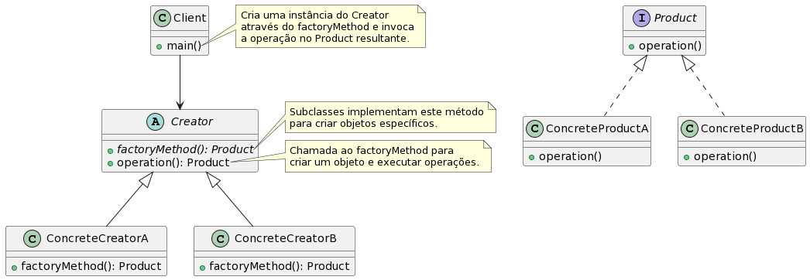

# estudo-design-pattern

## Padrão de projeto de criação

### Factory method

#### Conceito
O Factory Method é um padrão de projeto criacional que fornece uma maneira de criar objetos sem especificar sua classe concreta. Em vez de chamar diretamente o construtor de uma classe para criar um objeto, o Factory Method define um método separado, geralmente chamado de "factory method", que lida com a criação do objeto.

O objetivo principal do Factory Method é fornecer uma interface abstrata para a criação de objetos, permitindo que as subclasses decidam qual objeto criar. Dessa forma, o código cliente que usa o Factory Method não precisa conhecer as classes concretas dos objetos que está criando, mas apenas a interface comum que eles implementam.

A estrutura básica do Factory Method inclui os seguintes componentes:

1. Product (Produto): É a interface comum que define as operações que os objetos criados pelo Factory Method devem suportar.

2. ConcreteProduct (Produto Concreto): São as classes concretas que implementam a interface Product.

3. Creator (Criador): É a classe abstrata ou interface que declara o factory method. Ela pode fornecer uma implementação padrão para o factory method ou deixá-lo abstrato e delegar a responsabilidade às subclasses.

4. ConcreteCreator (Criador Concreto): São as subclasses que implementam o factory method para criar objetos específicos do ConcreteProduct.

O fluxo típico do Factory Method envolve o seguinte processo:

1. O código cliente chama o factory method em um objeto Creator.

2. O factory method do Creator é implementado na subclasse correspondente, que cria um objeto ConcreteProduct.

3. O objeto ConcreteProduct é retornado para o código cliente através do factory method.

O Factory Method permite que você adie a decisão de qual objeto criar para as subclasses, fornecendo flexibilidade e extensibilidade ao projeto. Ele também facilita a adição de novos tipos de objetos sem modificar o código existente, seguindo o princípio aberto/fechado (Open/Closed Principle) dos princípios SOLID.

Em resumo, o Factory Method é um padrão que encapsula a criação de objetos em uma classe separada, permitindo que subclasses decidam qual objeto criar, fornecendo uma interface comum para o código cliente e facilitando a extensibilidade do sistema.
#### Quando usar
O Factory Method é um padrão de projeto criacional que fornece uma abordagem para criar objetos sem especificar explicitamente suas classes concretas. Ele encapsula a lógica de criação de objetos em uma classe separada, conhecida como classe de fábrica, permitindo que as subclasses decidam qual objeto criar.

O Factory Method é útil em várias situações, incluindo:

1. Criação de objetos em tempo de execução: Quando você não sabe antecipadamente quais objetos precisará criar durante a execução do programa, o Factory Method pode ser usado para criar esses objetos com base em certas condições ou parâmetros.

2. Abstração da lógica de criação: Se a lógica de criação de objetos for complexa e requerer várias etapas, o Factory Method pode ajudar a abstrair essa complexidade em uma classe de fábrica dedicada. Isso mantém o código cliente mais limpo e focado em sua funcionalidade principal.

3. Suporte a extensibilidade: O Factory Method facilita a adição de novos tipos de objetos sem modificar o código existente. Basta criar uma nova classe de produto e uma correspondente classe de fábrica para lidar com a criação desse novo tipo de objeto.

4. Separação de responsabilidades: O Factory Method permite que você separe a responsabilidade da criação de objetos do resto do código. Isso pode melhorar a modularidade e facilitar a manutenção, pois cada classe se concentra em uma tarefa específica.

5. Testabilidade: Ao usar o Factory Method, você pode substituir facilmente a classe de fábrica por uma versão mock durante os testes, permitindo testar partes do código que dependem dos objetos criados pela fábrica.

É importante notar que o Factory Method é aplicável em cenários em que você precisa criar famílias de objetos relacionados. Se você estiver lidando com a criação de um único objeto, o padrão Simple Factory (também conhecido como Static Factory) pode ser uma opção mais adequada.

Em resumo, use o Factory Method quando você precisar abstrair a criação de objetos, lidar com a criação em tempo de execução, permitir extensibilidade e separar responsabilidades.

#### Exemplos
Exemplo simples


```java
// Interface Product
interface Product {
    void operation();
}

// ConcreteProduct A
class ConcreteProductA implements Product {
    public void operation() {
        System.out.println("ConcreteProductA operation");
    }
}

// ConcreteProduct B
class ConcreteProductB implements Product {
    public void operation() {
        System.out.println("ConcreteProductB operation");
    }
}

// Creator
abstract class Creator {
    public abstract Product factoryMethod();

    public void operation() {
        Product product = factoryMethod();
        product.operation();
    }
}

// ConcreteCreator A
class ConcreteCreatorA extends Creator {
    public Product factoryMethod() {
        return new ConcreteProductA();
    }
}

// ConcreteCreator B
class ConcreteCreatorB extends Creator {
    public Product factoryMethod() {
        return new ConcreteProductB();
    }
}

// Client
public class Client {
    public static void main(String[] args) {
        Creator creatorA = new ConcreteCreatorA();
        creatorA.operation(); // Output: ConcreteProductA operation

        Creator creatorB = new ConcreteCreatorB();
        creatorB.operation(); // Output: ConcreteProductB operation
    }
}
```

Exemplo UML de um sistema de autenticação:


Código:

```java
abstract class Autenticacao {
    public abstract boolean autenticar();
}

class AutenticacaoSenha extends Autenticacao {
    public boolean autenticar() {
        // Lógica de autenticação por senha
        return true;
    }
}

class AutenticacaoImpressaoDigital extends Autenticacao {
    public boolean autenticar() {
        // Lógica de autenticação por impressão digital
        return true;
    }
}

class FabricaAutenticacao {
    public Autenticacao criarAutenticacao(String metodo) {
        if (metodo.equals("senha")) {
            return new AutenticacaoSenha();
        } else if (metodo.equals("impressaoDigital")) {
            return new AutenticacaoImpressaoDigital();
        } else {
            throw new IllegalArgumentException("Método de autenticação inválido.");
        }
    }
}

class Cliente {
    private Autenticacao autenticacao;

    public boolean realizarAutenticacao(String metodo) {
        autenticacao = new FabricaAutenticacao().criarAutenticacao(metodo);
        return autenticacao.autenticar();
    }
}
```

## Links
- [Design pattern com Typescript - Otávio Miranda](https://www.youtube.com/playlist?list=PLbIBj8vQhvm0VY5YrMrafWaQY2EnJ3j8H)
- [Github do projeto Padrões de projeto com TypeScript - Otávio Miranda](https://github.com/luizomf/design-patterns-typescript/)
- [PlantUML: gerar imagem UML](https://plantuml.com/starting)
- [Factory Method - refactoring.guru/](https://refactoring.guru/pt-br/design-patterns/factory-method)
- [Curso Padrões de Projeto com Java - Reinaldo Dev](https://www.youtube.com/playlist?list=PLuYctAHjg89bBeh25plGraaYiAsryusw6)
- [Repositório da playlist do Reinaldo Dev](https://github.com/rinaldodev/design-patterns)
